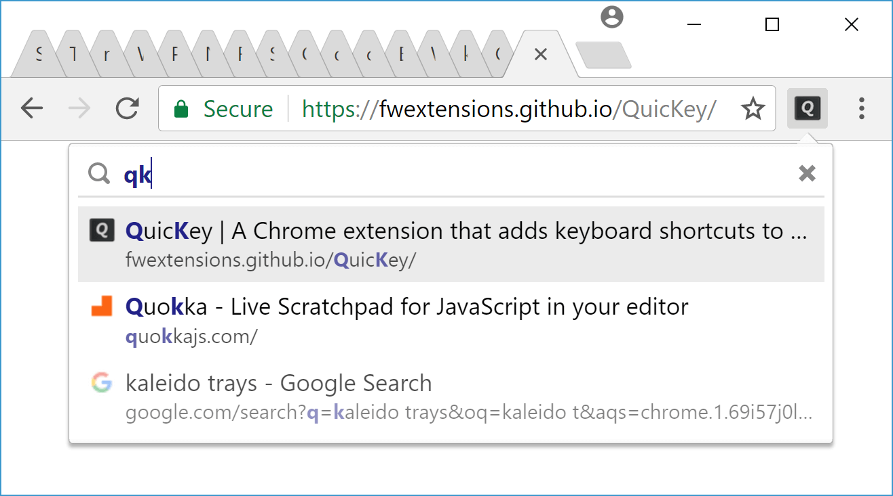

If you like to keep lots of tabs open in Chrome, it can quickly become difficult to find the one you want.  The tabs get very small, so you have to hover over each one to see its name in a tooltip.  And there's no overall Windows menu that would let you more easily pick a tab from a list.

*QuicKey* makes tabs much easier to navigate.  Just use its keyboard shortcut to open the search box type a few letters of a tab's name or URL, and then press <kbd>enter</kbd>.  You can even search through bookmarks and your browser history.

## Installation

Install *QuicKey* from the [Chrome Web Store](https://chrome.google.com/webstore/detail/quickey-–-the-quick-tab-s/ldlghkoiihaelfnggonhjnfiabmaficg).

Once the extension is installed, you can click the  button on the toolbar to open the search box.  But if you're using this extension, you probably prefer using the default keyboard shortcut:

  * Windows: <kbd>alt</kbd>&nbsp;<kbd>Q</kbd>
  * macOS: <kbd>ctrl</kbd>&nbsp;<kbd>Q</kbd>

To change these, you can go to *More tools > Extensions*, scroll to the very bottom of the page, and then click *Keyboard Shortcuts*.

## Fast tab switching

When you've opened the *QuicKey* search box via the shortcut key or by clicking its icon, type a few letters of the title or URL of the tab you're looking for.  Unlike other tab switchers, *QuicKey* uses a [Quicksilver](https://github.com/quicksilver/Quicksilver)-style search algorithm to rank the results, where contiguous matches at the beginning of words are higher in the list, as are matches against capital letters at the beginning of words.  So you can type just a few letters to quickly find the right tab.

The first matched tab is selected by default, so you can just press <kbd>enter</kbd> to switch to it.  Or press the <kbd>&#8593;</kbd>, <kbd>&#8595;</kbd>, <kbd>pg up</kbd> or <kbd>pg dn</kbd> key to move to other results.  You can also click the desired tab using the mouse.

Press <kbd>esc</kbd> to clear what you've typed.  If the search box is empty, then pressing <kbd>esc</kbd> will close it.

## Search bookmarks

Besides tabs, you can also quickly open bookmarks or pages from your browser history using *QuicKey*.  To search all of your bookmarks, type <kbd>/</kbd>&nbsp;<kbd>b</kbd>&nbsp;<kbd>space</kbd>, and then start typing part of the name or URL of a bookmark.

When you've selected the desired bookmark, press <kbd>enter</kbd> to open it in the current tab.  Press <kbd>ctrl</kbd>&nbsp;<kbd>enter</kbd> (<kbd>cmd⌘</kbd>&nbsp;<kbd>enter</kbd> on macOS) to open the bookmark in a new tab in the current window, or press <kbd>shift</kbd>&nbsp;<kbd>enter</kbd> to open the bookmark in a new window.

## Search history

To match a page from your history, type <kbd>/</kbd>&nbsp;<kbd>h</kbd>&nbsp;<kbd>space</kbd> and then start typing part of the name or URL of a page.  The same <kbd>ctrl</kbd>&nbsp;<kbd>enter</kbd> and <kbd>shift</kbd>&nbsp;<kbd>enter</kbd> shortcuts work with visited pages to open them in new tabs or windows.  The last 2000 pages in the history are available for searching through *QuicKey*.

## The Great Suspender integration

If you use the handy extension [The Great Suspender](https://chrome.google.com/webstore/detail/the-great-suspender/klbibkeccnjlkjkiokjodocebajanakg?hl=en) (and you almost certainly are if you have hundreds of tabs open), then suspended tabs will have a faded icon in the list, and the original URL is shown, not that long one that you see in the location bar.  Pressing <kbd>enter</kbd> will switch to the suspended tab, but you can press <kbd>shift</kbd>&nbsp;<kbd>enter</kbd> to switch to the tab and unsuspend it in one go. Or shift-click it with the mouse.

Sometimes The Great Suspender seems to forget the page's favicon and just shows its own in the tab.  In that case, *QuicKey* will try to show the correct favicon.

## Close tabs

You can quickly close the selected tab by pressing <kbd>ctrl</kbd>&nbsp;<kbd>W</kbd> (<kbd>cmd⌘</kbd>&nbsp;<kbd>W</kbd> on macOS). So you could type "docg" to match all of your Google Docs URLs and then quickly close each one.

## Incognito mode

By default, Chrome extensions are not enabled in incognito mode.  If you want to use *QuicKey* to switch to incognito tabs as well as normal ones, go to *More tools > Extensions*, scroll down to *QuicKey*, and check the "Allow in incognito" option.

Tabs in incognito mode display the incognito icon, so you distinguish a normal tab from an incognito one with the same title.

## Privacy

To function, *QuicKey* needs access to your open tabs, bookmarks and history.  The permissions dialog says *QuicKey* can also change your bookmarks and browsing history, but it never will.  It also doesn't interact with the page content in any way and doesn't transmit any information anywhere.

## Feedback and bugs

If you find a bug in *QuicKey* or have a suggestion for a new feature, please [create a new issue](https://github.com/fwextensions/QuicKey/issues) on the GitHub repo.

## Credits

The  and  icons are from the [Octicons](https://octicons.github.com/) set, used under the [MIT License](http://opensource.org/licenses/MIT).

Search algorithm modeled on [Quicksilver](https://github.com/quicksilver/Quicksilver/blob/master/Quicksilver/Code-QuickStepCore/QSense.m)'s search code.
