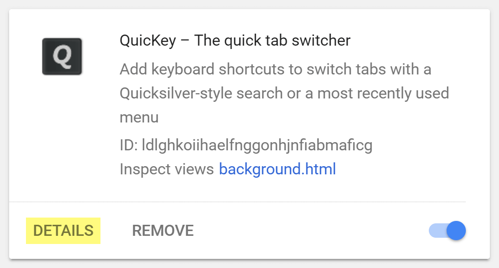

---

image: img/og-image.png

---

  

    <ul class="glide__slides">
      <li class="glide__slide"></li>
      <li class="glide__slide"></li>
      <li class="glide__slide"></li>
      <li class="glide__slide"></li>
    </ul>
  

#### *QuicKey* lets you navigate all of your Chrome tabs by typing just part of a page's title or URL.  No mouse needed!

  * Press <b><kbd>alt</kbd><kbd>Q</kbd></b> (<b><kbd>ctrl</kbd><kbd>Q</kbd></b> on macOS).
  * Type a few letters.
  * Press <kbd>enter</kbd> to switch to the selected tab.

To toggle between the two most recently used tabs, quickly press the keyboard shortcut twice.  Or pick a tab from the most recently used (MRU) list as [shown below](#mru).

You can also type <b><kbd>/</kbd><kbd>b</kbd></b> to search [bookmarks](#bookmarks) or <b><kbd>/</kbd><kbd>h</kbd></b> to search your [browser history](#history).

## Installation

<button onclick="installExtension(1)">Install Now</button> or go to the <a href="https://chrome.google.com/webstore/detail/quickey-–-the-quick-tab-s/ldlghkoiihaelfnggonhjnfiabmaficg">Chrome Web Store</a> to install <em>QuicKey</em>.

Once the extension is installed, you can click the  button on the toolbar to open the search box.  But if you like this extension, you'll probably prefer using the default keyboard shortcut listed above.

You can customize the shortcut key by right-clicking the *QuicKey* icon and selecting *Options*.

## Search for a tab quickly

Unlike other tab switchers, *QuicKey* uses a [Quicksilver](https://qsapp.com/)-style search algorithm to rank the results, where contiguous matches at the beginning of words are higher in the list, as are matches against capital letters.  So you can type just a few letters to quickly find the right tab.

Use keyboard shortcuts to navigate the list of matching tabs:

  * <kbd>enter</kbd>&nbsp;: switch to the selected tab
  * <kbd>↓</kbd> or <kbd>space</kbd>&nbsp;: move down the list
  * <kbd>↑</kbd> or <b><kbd>shift</kbd><kbd>space</kbd></b>&nbsp;: move up the list
  * <kbd>pg dn</kbd>&nbsp;: page down the list
  * <kbd>pg up</kbd>&nbsp;: page up the list
  * <kbd>end</kbd>&nbsp;: go to the bottom of the list
  * <kbd>home</kbd>&nbsp;: go to the top of the list
  * <kbd>esc</kbd>&nbsp;: clear the search or close the menu

If you type more than 25 letters, which should be plenty to find the right tab, *QuicKey* switches to an exact string search to stay fast.

Recently used tabs get a slight boost in the search results ranking, so getting back to a tab you were just using should require typing fewer letters.

## Navigate the most recently used (MRU) tabs

> **Note:** When first installed, *QuicKey* doesn't know which tabs have been recently used, but as you use Chrome, it will start adding tabs to the MRU list.

Opening *QuicKey* displays a list of the last 50 tabs you've visited, in order of recency.  Click a tab to switch to it, or use one of the keyboard shortcuts below to navigate the recently used tab history:

&nbsp;

  * **To switch to the previously active tab:**
      * Quickly double-press the <b><kbd>alt</kbd><kbd>Q</kbd></b> or <b><kbd>ctrl</kbd><kbd>Q</kbd></b> shortcut.

&nbsp;

  * **To navigate farther back in the MRU list:**
    * Press <b><kbd>alt</kbd><kbd>A</kbd></b> (<b><kbd>ctrl</kbd><kbd>A</kbd></b> on macOS) once to switch to the previous tab.  The *QuicKey* icon will invert for .75 seconds: <b> ➤ </b>.
    * Press <b><kbd>alt</kbd><kbd>A</kbd></b> again while the icon is inverted to switch to older tabs, once for each tab.
    * Press <b><kbd>alt</kbd><kbd>S</kbd></b> to move to newer tabs.
    * Pause to let the icon revert to normal: <b> ➤ </b>.
    * Press <b><kbd>alt</kbd><kbd>A</kbd></b> again to switch back to the tab you initially started on.

&nbsp;

  * **To pick a recent tab from the MRU menu:**
    * Press the shortcut but keep holding the <kbd>alt</kbd> key (<kbd>ctrl</kbd> key on macOS).
    * Press <kbd>W</kbd> to move down through the list of recent tabs.
    * Press <b><kbd>shift</kbd><kbd>W</kbd></b> to move up.
    * Release <kbd>alt</kbd> (or <kbd>ctrl</kbd>) to switch to the selected tab.
    * You can also highlight an item with the mouse, then release <kbd>alt</kbd> to go to that tab.

Which shortcuts to use is up to you.  Double-pressing <b><kbd>alt</kbd><kbd>Q</kbd></b> is nice because there's just one shortcut and you can switch between the two most recently used tabs as quickly as you want.  (You can also double-click the *QuicKey* icon to toggle between the most recent tabs.)

<b><kbd>alt</kbd><kbd>A</kbd></b> lets you quickly navigate to even older tabs, though the timing can be a little tricky.

Selecting from the MRU menu by holding down the <kbd>alt</kbd> key provides the closest experience to a typical <b><kbd>alt</kbd><kbd>tab</kbd></b> menu, but you need to use a different key to navigate the list while the menu is open (due to limitations in Chrome extensions).

You can change the <b><kbd>alt</kbd><kbd>A</kbd></b> and <b><kbd>alt</kbd><kbd>S</kbd></b> shortcuts by right-clicking the *QuicKey* icon and selecting *Options*.  Look for the *Switch to the previous/next tab* shortcuts.

## Close and reopen tabs

To close the selected tab, press <b><kbd>ctrl</kbd><kbd>W</kbd></b> (<b><kbd>cmd</kbd><kbd>ctrl</kbd><kbd>W</kbd></b> on macOS).  Or hover over a tab and click the close button on the right side of the menu:

When you open *QuicKey*, the 25 most recently closed tabs are listed below the recent tabs and shown in a faded state with an  icon.  They are also returned when you type a query, though they're scored lower than open tabs:

Click a closed tab to reopen it in its original location and with all of its browsing history intact.

## Move tabs

You can move tabs to the left or right of the current tab, making it easy to pull tabs from other windows into the current one, or to rearrange tabs without using the mouse.

  * Press <b><kbd>ctrl</kbd><kbd>[</kbd></b> to move the selected tab to the left of the current one.
  * Press <b><kbd>ctrl</kbd><kbd>]</kbd></b> to move it to the right.

Include <kbd>shift</kbd> in the shortcut to also unsuspend the tab while moving it.  The <kbd>ctrl</kbd> key should be used on both Windows and macOS.

## Search bookmarks

To find a bookmark, type <b><kbd>/</kbd><kbd>b</kbd><kbd>space</kbd></b> in the search box, and then part of the bookmark's name or URL.

  * Press <kbd>enter</kbd> to open the bookmark in the current tab.
  * Press <b><kbd>ctrl</kbd><kbd>enter</kbd></b> (<b><kbd>cmd</kbd><kbd>enter</kbd></b> on macOS) to open it in a new tab in the current window.
  * Press <b><kbd>shift</kbd><kbd>enter</kbd></b> to open it in a new window.

## Search the browser history

To find something in the last 2000 pages of your browser history, type <b><kbd>/</kbd><kbd>h</kbd><kbd>space</kbd></b> in the search box, and then part of the page's name or URL.

The same <b><kbd>ctrl</kbd><kbd>enter</kbd></b> (<b><kbd>cmd</kbd><kbd>enter</kbd></b> on macOS) and <b><kbd>shift</kbd><kbd>enter</kbd></b> shortcuts will open the visited page in a new tab or window.

##  The Great Suspender integration

If you use the handy extension [The Great Suspender](https://chrome.google.com/webstore/detail/the-great-suspender/klbibkeccnjlkjkiokjodocebajanakg?hl=en) (and you almost certainly do if you have hundreds of tabs open), then suspended tabs will look faded in the list:

The original URL is shown in the menu (not that long `chrome-extension://` one you see in the location bar), so if you search for `chrome` or `extension`, you won't simply match all the suspended tabs, which is what happens in other tab search extensions.

Press <b><kbd>shift</kbd><kbd>enter</kbd></b> to switch to a tab and unsuspend it in one go. Or shift-click it with the mouse.

## Incognito mode

To switch to incognito tabs as well as normal ones, open Chrome's main menu and then go to *More tools > Extensions*, scroll down to the *QuicKey* extension, and then click the *DETAILS* button:

On the next page, scroll down and click the toggle button next to the *Allow in incognito* option:

Tabs in incognito mode display the incognito icon under the page's favicon, so you can distinguish a normal tab from an incognito one with the same title:

## Privacy policy

When first installed, *QuicKey* asks for these permissions:

- *Read and change your browsing history on all signed-in devices*

    *QuicKey* uses this permission to let you search the titles and URLs of the open tabs, as well as pages from your history. The *"all signed-in devices"* part is there only so that recently closed tabs can be restored with their full history.

- *Read and change your bookmarks*

    *QuicKey* uses this permission to let you search the titles and URLs of your bookmarked pages. It will never change your bookmarks.

*QuicKey* can't access the content of any pages you visit and doesn't transmit any information other than some anonymized Google Analytics metrics.

## Feedback and bugs

If you find a bug in *QuicKey* or have a suggestion for a new feature, please [create a new issue](https://github.com/fwextensions/QuicKey/issues/new) on its GitHub page.

## Credits

The  and  icons are from the [Octicons](https://octicons.github.com/) set, used under the [MIT License](http://opensource.org/licenses/MIT).

The string ranking algorithm is modeled on [Quicksilver](https://github.com/quicksilver/Quicksilver/blob/master/Quicksilver/Code-QuickStepCore/QSense.m)'s code.
